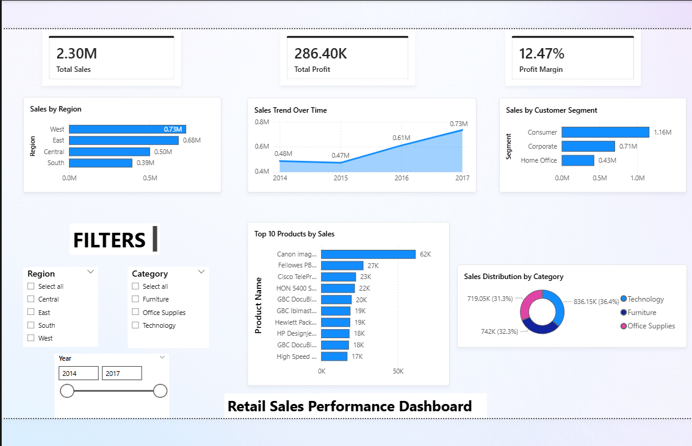

# Retail Sales Analytics Project

## Overview
This project analyzes retail sales data to identify trends, regional performance, and product insights.

## Tools Used
- Python (Pandas)
- SQL
- Power BI

## Project Steps
1. Data Cleaning using Python
2. Exploratory Data Analysis
3. SQL Queries for business insights
4. Interactive Dashboard in Power BI

## Dashboard Preview

## Key Insights
- West region generates the highest sales.
- Technology category contributes the most revenue.
- Consumer segment drives the majority of orders.

